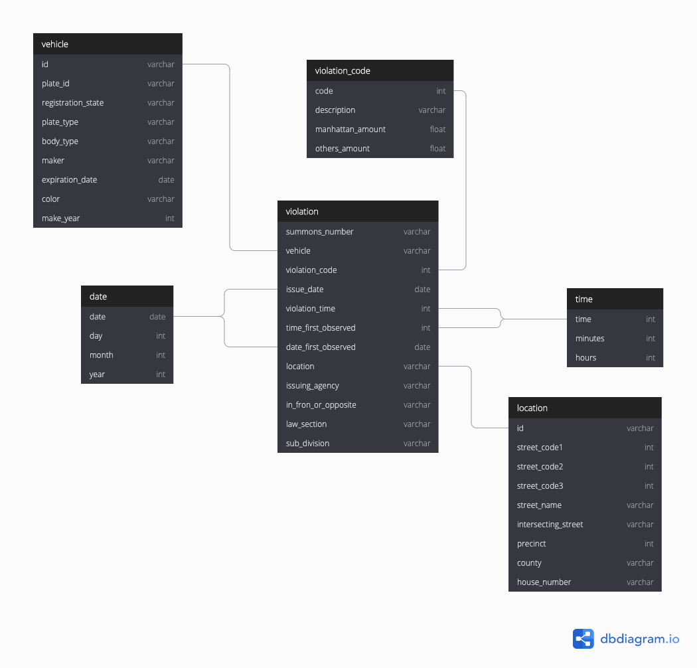
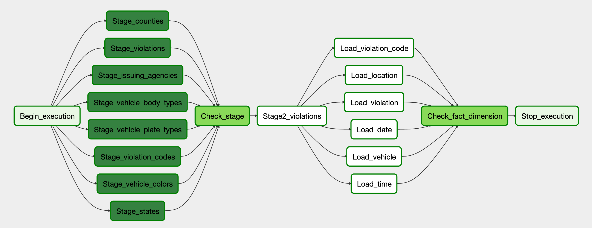

# Purpose

Building a data warehouse and data pipelines for analyzing annual parking violations in New York. For example, the result can be simply used to answer the following questions. Which time of the (year, day) gets the most number of violations? Which type of vehicle gets the most number of parking violations? Which place has the most parking violations?

# Datasets

## Parking Violations Issued - Fiscal Year 2020

Parking Violations Issuance datasets contain violations issued during the respective fiscal year. This is the main dataset. A csv file with more than 4 millions records.

Source: https://data.cityofnewyork.us/City-Government/Parking-Violations-Issued-Fiscal-Year-2020/pvqr-7yc4

## DOF Parking Violation Codes

This dataset defines the parking violation codes in New York City and 
lists the fines.

Source: https://data.cityofnewyork.us/Transportation/DOF-Parking-Violation-Codes/ncbg-6agr

## State Codes

This dataset defines the all the USA states codes.

Source: [ACRIS - State Codes | NYC Open Data](https://data.cityofnewyork.us/City-Government/ACRIS-State-Codes/5c9e-33xj)

## Vehicle Body Types

This dataset defines all the vehicle body types with their codes that are used in the main dataset.

Source: https://data.ny.gov/api/assets/83055271-29A6-4ED4-9374-E159F30DB5AE

## Vehicle Colors

This dataset defines all the vehicle colors with their codes that are used in the main dataset.

Source: https://data.ny.gov/api/assets/83055271-29A6-4ED4-9374-E159F30DB5AE

## Counties

This dataset defines all the counties with their codes that are used in the main dataset.

Source: [List of counties in New York - Simple English Wikipedia, the free encyclopedia](https://simple.wikipedia.org/wiki/List_of_counties_in_New_York)

## Issuing Agencies

This dataset defines all the issuing agencies with their codes that are used in the main dataset.

Source: https://data.cityofnewyork.us/City-Government/Parking-Violations-Issued-Fiscal-Year-2020/pvqr-7yc4

## Vehicle Plate Types

This dataset defines all the vehicle plate types.

Source: https://data.ny.gov/api/assets/83055271-29A6-4ED4-9374-E159F30DB

# Data Exploration

All information related to the used data is provided in the jupyter notebook `DataExploration.ipynb`.

# Data Model

The modeling uses the start schema model. There is only one fact table, **violation**, and fife dimenstion tables, **vehicle, violation_code, location, date, and time**.

## Why separate dimensions for date and time?

It will allow us to store information related to date (e.g., holidays) in the date dimension. If we use one dimension we would need to store date information on all records with the same date. Also, using one dimension for both date and time may lead to a huge dimension.  Finally, according to this article in Wikipedia ([Dimension (data warehouse) - Wikipedia](https://en.wikipedia.org/wiki/Dimension_(data_warehouse)#Common_patterns)), it is a common pattren to do so.

# Data Pipeline

The source data resides in Amazon S3 and needs to be extracted, transformed, and loaded in Redshift. The source datasets mainly consist of one large csv file which contains violations, as well as some small csv and json files which are used as mappings for some columns (e.g., vehicle colors, vehicle plate types). **Apache Airflow** is used to schedule and monitor the data pipeline.

## Summary of The Data Journey

First, we extract the data from S3 and load it into the staging tables. Then, we do some quality checks on the raw data before doing any transformation. For example, one of the checks `Check_stage` task do is checking if the percentage of missing values of some important columns exceeds a defined threshold. If the check fails, we stop. If it succeeded, we do, some transformation (mainly denormalization). In stage 2, the data is recieved denormalized. The data is transformed and loaded from the stage 2 into the fact and dimension tables.

## DAG Design

The dag can be divided in three main layers. First staging layer, second staging layer, and fact and dimension loading layer.

### 

### First Staging Layer

This layer contains staging tables. Each staging tables correspond to one dataset. Here we load the raw data from the datasets into the appropoiate table with little to no transformation (e.g., some date format transformation is done here). 

### Second Staging Layer

First, why second staging layer? To be honest, at first, this layer didn't exist. At that time I faced a lot of challagnes trying to transform the data directly from the staging tables into the fact and dimension tables. A lot of the queries were complex and bad in performance. I even couldn't do some requirements; do to Redshift not supporting some correlated subqueries (see https://docs.aws.amazon.com/redshift/latest/dg/r_correlated_subqueries.html for details). Thus, I decided to create a second layer.

In this layer, we denormalize the data. Also, we do some transformation and drop unwanted data.

**A quality data check exists between the first and second layer.** This check ensures that the validity of the raw data before doing any transformation.

### Fact and Dimension Loading Layer

As the name suggests, in this layer we load the data into the dimension and fact tables.

A quality data check is done after loading the fact and dimension tables. In this check we validate the final data in the fact and dimension tables. 

# Tools and Technologies

## Why a Data warehouse?

At the beginning I considered three options for storing the data, a relational database, a NoSQL database, and a data lake. The main factor that led me to chose the data warehosue approach is the relational structure of the used datasets. I would've considered using a NoSQL database if availibility was a major concern. Also, if I knew that our data is growing rapidly (NoSQL databases scale horizontally). Nontheless, we could use AWS Redshift [Concurrency Scaling](https://docs.aws.amazon.com/redshift/latest/dg/concurrency-scaling.html) if needed.

## Tools

The main used tools are:

* `Amazon S3` is used to store the raw data

* `Amazon Redshift` is used to create Data warehouse

* `Apache Airflow` is used to schedule, configure, and montior the data pipeline

# How to run the project

## Airflow Installation

Firrst, you have to install [Apache Airflow]([Installation &mdash; Airflow Documentation](https://airflow.apache.org/docs/stable/installation.html)). 

1. Install apache airflow with postgress `pip install apache-airflow[postgres]`

2. Initialize Airflow database`airflow initdb`
   Once you have installed Airflow, place the project under the DAGs folder references in your `airflow.cfg` flle. The default location for your DAGs is `~/airflow/dags`.
   Now run Airflow using these commands:
   `airflow scheduler --daemon`
   `airflow webserver --daemon -p 3000`
   After doing that, you will be able to access Airflow UI under `http://localhost:3000`.
   
   ## Variables and Connections
   
   Create  configuration variables and connections in airflow (use udacity page)
   There are 4 variables and 2 connections that are needed to be configured.
   Go to Airflow UI.
   
   ### Configuring Variables
   
   From the Admin menu in the top menu bar, select `Variables`. Create these Variables:
- `s3_violations_bucket` which holds the AWS S3 bucket

- `s3_parking_violations_states_key` which holds the states file key

- `s3_parking_violations_violation_codes_key` which holds the violation codes file key

- `s3_parking_violations_vehicle_body_types_key` which holds the vehicle body types file key

- `s3_parking_violations_vehicle_body_types_jsonpaths_key` which holds the vehicle body types jsonpaths file key

- `s3_parking_violations_vehicle_plate_types_key` which holds the vehicle plate types file key
* `s3_parking_violations_vehicle_plate_types_jsonpaths_key` which holds the vehicle plate types jsonpaths file key
- `s3_parking_violations_vehicle_colors_key` which holds the vehicle colors file key
  
  `s3_parking_violations_vehicle_colors_jsonpaths_key` which holds the vehicle colors jsonpaths file key
  
  `s3_parking_violations_key` which holds the violations file key
  
  ### Configuring Connections
  
  Then, from the same Admin menu, select `Connections`. Create these Connections:
* `aws_credentials` of type `Amazon Web Services`

* `redshift` of type `Postgres`
  
  ## Creating Tables
  
  Ceate the tables that are defined in `tables.sql` in your Redshift cluster.
  
  Finally, after completing these steps, you should be able to turn the Dag on using the Airflow UI.
